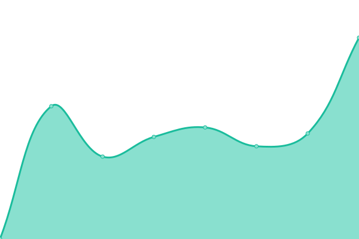
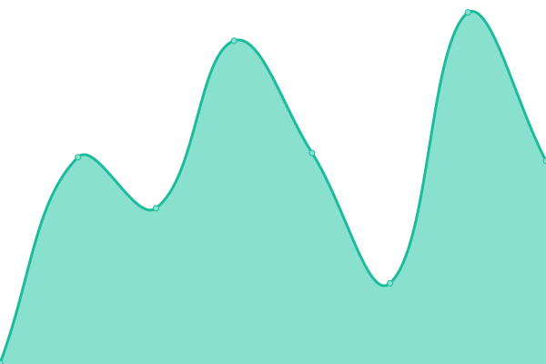
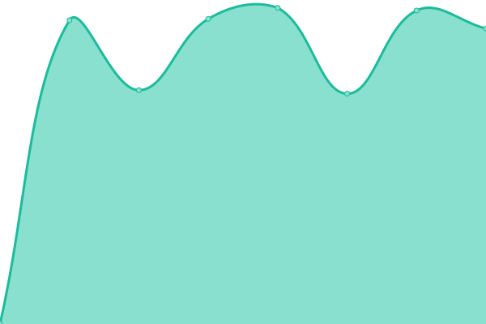

Status page powered by upptime.

🖥📉💥

<!--start: status pages-->
<!-- This summary is generated by Upptime (https://github.com/upptime/upptime) -->
<!-- Do not edit this manually, your changes will be overwritten -->
<!-- prettier-ignore -->
| URL | Status | History | Response Time | Uptime |
| --- | ------ | ------- | ------------- | ------ |
|  [nikolai.cc](https://www.nikolai.cc) | 🟩 Up | [nikolai-cc.yml](https://github.com/nikolai-cc/upp/commits/HEAD/history/nikolai-cc.yml) | 

 999ms
     
 | 

<a href="https://nikolai-cc.github.io/upp/history/nikolai-cc">100.00%</a>
    

|  [altijd design](https://www.altijd.design) | 🟩 Up | [altijd-design.yml](https://github.com/nikolai-cc/upp/commits/HEAD/history/altijd-design.yml) | 

 680ms
     
 | 

<a href="https://nikolai-cc.github.io/upp/history/altijd-design">100.00%</a>
    

|  [theministry](https://www.theministry.co) | 🟩 Up | [theministry.yml](https://github.com/nikolai-cc/upp/commits/HEAD/history/theministry.yml) | 

 47ms
     
 | 

<a href="https://nikolai-cc.github.io/upp/history/theministry">99.82%</a>
    

|  [Massasjehuset](https://www.massasjehuset.nl) | 🟩 Up | [massasjehuset.yml](https://github.com/nikolai-cc/upp/commits/HEAD/history/massasjehuset.yml) | 

 772ms
     
 | 

<a href="https://nikolai-cc.github.io/upp/history/massasjehuset">100.00%</a>
    

|  [Rob Alofs](http://www.robalofs.nl) | 🟩 Up | [rob-alofs.yml](https://github.com/nikolai-cc/upp/commits/HEAD/history/rob-alofs.yml) | 

 431ms
     
 | 

<a href="https://nikolai-cc.github.io/upp/history/rob-alofs">100.00%</a>
    

|  [Betsinor](https://www.betsinor.fr) | 🟩 Up | [betsinor.yml](https://github.com/nikolai-cc/upp/commits/HEAD/history/betsinor.yml) | 

 988ms
     
 | 

<a href="https://nikolai-cc.github.io/upp/history/betsinor">100.00%</a>
    

|  [LEDbits](https://www.ledbits.eu) | 🟩 Up | [le-dbits.yml](https://github.com/nikolai-cc/upp/commits/HEAD/history/le-dbits.yml) | 

 658ms
     
 | 

<a href="https://nikolai-cc.github.io/upp/history/le-dbits">100.00%</a>
    

|  [Bumi Bars](https://www.bumibars.nl) | 🟩 Up | [bumi-bars.yml](https://github.com/nikolai-cc/upp/commits/HEAD/history/bumi-bars.yml) | 

 2919ms
     
 | 

<a href="https://nikolai-cc.github.io/upp/history/bumi-bars">99.84%</a>
    

<!--end: status pages-->
